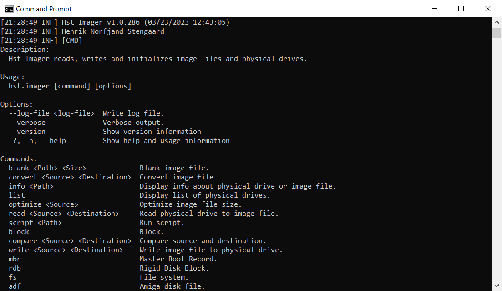

# Hst Imager


Hst Imager is an imaging tool to read and write disk images to and from physical drives. It supports reading from .rar, .zip, .gz, .xz compressed image files when writing to physical drive and writing to .zip, .gz compressed image files when reading from physical drive.

This tool can be used to create new blank images or create images of physical drives like hard disks, SSD, CF- and MicroSD-cards for backup and/or modification and then write them to physical drives.

> **Warning**
> Hst Imager has been tested extensively regarding it's raw disk access.
> However it's highly recommended to make a backup of your physical drive or image file, so your working with a copy in case Hst Imager might corrupt it.
> **YOU HAVE BEEN WARNED NOW!**

> **Warning**
> Hst Imager filters out fixed disks, so only USB attached physical drives are accessible. Be very sure to select the correct physical drive. Otherwise Hst Imager might destroy your disk and it's file system.
> Raw disk access requires administrator privileges, so you need to run as administrator or with sudo.

## Supported operating systems

Hst Imager supports following operating systems:
- Windows
- macOS
- Linux

## Versions

Hst Imager comes as a gui and a console version.

### Gui

[](src/Hst.Imager.GuiApp#hst-imager-gui)

See [Hst Imager Gui](src/Hst.Imager.GuiApp#hst-imager-gui) page for installation and usage of Hst Imager Gui.

### Console

[](src/Hst.Imager.ConsoleApp#hst-imager-console)

See [Hst Imager Console](src/Hst.Imager.ConsoleApp#hst-imager-console) page for installation and usage of Hst Imager Console.

## Features

Hst Imager Gui comes with following features:
- List physical drives.
- Read information from physical drive or image file (supports writing .rar, .zip, .gz, .xz compressed image files).
- Read physical drive to image file (supports writing to .zip, .gz, compressed image files).
- Write image file to physical drive (supports reading from .rar, .zip, .gz, .xz compressed image files).
- Convert image file between .img/.hdf and .vhd (supports reading from .rar, .zip, .gz, .xz compressed image files).
- Create blank .img/.hdf and .vhd image file.
- Optimize image file size.

Hst Imager Console version comes with following additional features:
- File system:
  - Supports local files and directories, image files, physical drives, ISO9660 .iso, Zip archive .zip, Lha archive .lha or Amiga Disk File .adf as source.
  - Supports local files and directories, image files, physical drives or Amiga Disk File .adf as destination.
  - List files and subdirectories in a file system.
  - Copy files from source to destination file system.
  - Extract files from source to destination file system.
- Amiga Disk File:
  - Create ADF disk image file.
- Master Boot Record:
  - Read Master Boot Record information.
  - Initialize Master Boot Record.
  - Add partition to Master Boot Record.
  - Export partition from Master Boot Record to file.
  - Delete partition from Master Boot Record.
  - Format partition in Master Boot Record.
  - Import partition from file to Master Boot Record partition.
  - Clone partition from Master Boot Record to same or other Master Boot Record partition.
- Rigid Disk Block:
  - Read Rigid Disk Block information.
  - Initialize Rigid Disk Block.
  - Resize Rigid Disk Block.
  - Add file system to Rigid Disk Block.
  - Delete file system from Rigid Disk Block.
  - Export file system from Rigid Disk Block to file.
  - Import file systems from Rigid Disk Block or ADF file.
  - Update file system in Rigid Disk Block.
  - Add partition to Rigid Disk Block.
  - Copy partition from one Rigid Disk Block to another.
  - Delete partition from Rigid Disk Block.
  - Export partition from Rigid Disk Block to hard file.
  - Format partition in Rigid Disk Block.
  - Import partition from hard file to Rigid Disk Block.
  - Kill and restore partition in Rigid Disk Block.
  - Move partition in Rigid Disk Block.
  - Update partition in Rigid Disk Block.
  - Backup Rigid Disk Block to file.
  - Restore Rigid Disk Block from file.

**Read and write to and from physical drives requires administrative rights on Windows, macOS and Linux.**

## Img file format

Img file format is a raw dump of hard disks, SSD, CF- and MicroSD-cards and consists of a sector-by-sector binary copy of the source.

Creating an .img image file from a 64GB CF-card using Hst Imager will require 64GB of free disk space on the specified destination path.

## Vhd file format

Vhd file format is a virtual hard disk drive with fixed and dynamic sizes.

Fixed sized vhd file pre-allocates the requested size when created same way as .img file format.

Dynamic sized vhd file only allocates storage to store actual data. Unused or zero filled parts of vhd file are not allocated resulting in smaller image files compared to img image files.

Creating a dynamic sized vhd image file from a 64GB CF-card using Hst Imager will only require free disk space on the specified destination path matching disk space used on source physical drive. Zero filled (unused) sectors are skipped, when creating a vhd image resulting in a much smaller image file.

## Amiga support

Hst Imager supports Amiga Rigid Disk Block (RDSK, partition table used by Amiga computers) and can initialize new Rigid Disk Block and modify existing Rigid Disk Block.

Reading an Amiga hard drive to an image files is very useful with Amiga emulators to make changes much faster than real hardware and afterwards write the modified image file back to a hard drive.

### Amiga emulators with vhd support

Following Amiga emulators support .vhd image files:
- WinUAE 4.9.0: https://www.winuae.net/
- FS-UAE v3.1.66: https://fs-uae.net/

FS-UAE might require following custom option to force RDB mode by manually changing FS-UAE configuration file (replace 0 with other hard drive number if needed):
```
hard_drive_0_type = rdb
```