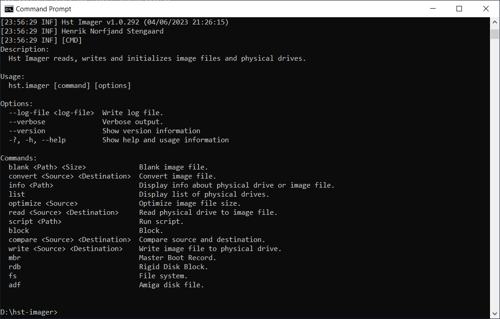

# Hst Imager Console

[](../../assets/hst-imager-console.png)

Console version of Hst Imager to read and write disk images to and from physical drives.

This tool can be used to create new blank images or create images of physical drives like hard disks, SSD, CF- and MicroSD-cards for backup and/or modification and then write them to physical drives.

> **Warning**
> Hst Imager has been tested extensively regarding it's raw disk access.
> However it's highly recommended to make a backup of your physical drive or image file, so your working with a copy in case Hst Imager might corrupt it.
> **YOU HAVE BEEN WARNED NOW!**

> **Warning**
> Hst Imager filters out fixed disks, so only USB attached physical drives are accessible. Be very sure to select the correct physical drive. Otherwise Hst Imager might destroy your disk and it's file system.
> Raw disk access requires administrator privileges, so you need to run as administrator or with sudo.


## Features

Hst Imager console comes with following features:
- List physical drives.
- Read information from physical drive or image file.
- Read physical drive to image file.
- Write image file to physical drive.
- Convert image file between .img/.hdf and .vhd.
- Create blank .img/.hdf and .vhd image file.
- Optimize image file size.
- File system:
  - Supports local files and directories, image files, physical drives, ISO9660 .iso, Zip archive .zip, Lha archive .lha or Amiga Disk File .adf as source.
  - Supports local files and directories, image files, physical drives or Amiga Disk File .adf as destination.
  - List files and subdirectories in a file system.
  - Copy files from source to destination file system.
  - Extract files from source to destination file system.
- Amiga Disk File:
  - Create ADF disk image file.
- Master Boot Record:
  - Read Master Boot Record information.
  - Initialize Master Boot Record.
  - Add partition to Master Boot Record.
  - Delete partition from Master Boot Record.
  - Format partition in Master Boot Record.
- Rigid Disk Block;
  - Read Rigid Disk Block information.
  - Initialize Rigid Disk Block.
  - Add file system to Rigid Disk Block.
  - Delete file system from Rigid Disk Block.
  - Export file system from Rigid Disk Block to file.
  - Import file systems from Rigid Disk Block or ADF file.
  - Update file system in Rigid Disk Block.
  - Add partition to Rigid Disk Block.
  - Copy partition from one Rigid Disk Block to another.
  - Delete partition from Rigid Disk Block.
  - Export partition from Rigid Disk Block to hard file.
  - Format partition in Rigid Disk Block.
  - Import partition from hard file to Rigid Disk Block.
  - Kill and restore partition in Rigid Disk Block.
  - Update partition in Rigid Disk Block.

## Supported operating systems

Hst Imager supports following operating systems:
- Windows
- macOS
- Linux

## Installation

- Download latest Hst Imager console version from [releases](https://github.com/henrikstengaard/hst-imager/releases).
- Extract Hst Imager console zip file.

Hst Imager is now ready to use.

## Usage

Hst Imager console application is invoked from the command line using the `hst.imager` command.

Invoking `hst.imager` command without any arguments, will display available commands and options.

Example of displaying usage:
```
hst.imager
```

The command line options for the Hst Imager console application are listed in the following sections.

## Administrator privileges

Commands accessing physical drives requires administrator privileges:
- Windows: Run `hst.imager` command from Command Prompt started as Administrator.
- macOS and Linux: Run `hst.imager` command from Terminal or shell with sudo, e.g. `sudo hst.imager list` to list physical drives.

Hst Imager will only allow access to removable or USB attached physical drives.

## Source and destination paths 

Source and destination paths in Hst Imager console commands supports physical drive and image file paths.

Only a few imaging commands can only be used image file paths. 

## Imaging commands

### List physical drives

Lists physical drives. Requires administrator privileges.

Example of listing physical drives:
```
hst.imager list
```

### Display information about a physical drive or image file

Displays information about a physical drive or image file by reading Master Boot Record and Rigid Disk Block and displays a table with partition tables present. Physical drives requires administrator privileges.

Example of display information about a Windows physical drive disk 2:
```
hst.imager info \disk2
```

Example of display information about a Linux physical drive /dev/sdb:
```
hst.imager info /dev/sdb
```

Example of display information about an 4GB vhd image file:
```
hst.imager info 4gb.vhd
```

### Read physical drive to image file

Reads physical drive to an image file. Physical drives requires administrator privileges. Supports reading to compressed gzip and zip image files using extensions: .gz and .zip.

Example of displaying usage for reading a physical drive to an image file:
```
hst.imager read \disk2 4gb.img
```

Example of displaying usage for reading a physical drive to an gzip compressed image file:
```
hst.imager read \disk2 4gb.img.gz
```

Example of reading Windows physical drive to 4gb.vhd image file:
```
hst.imager read \disk2 4gb.vhd
```

Example of reading Linux physical drive /dev/sdb to 4gb.vhd image file:
```
hst.imager read /dev/sdb 4gb.vhd
```

### Write image file to physical drive

Writes an image file to physical drive. Physical drives requires administrator privileges. Supports writing from compressed gzip, zip, xz and rar image files using extensions: .gz, .zip, .xz, .rar.

Example of displaying usage for writing an image file to a physical drive:
```
hst.imager write
```

Example of writing 4GB xz compressed image file to Windows physical drive disk 2:
```
hst.imager write 4gb.img.xz \disk2
```

Example of writing 4GB vhd image file to Windows physical drive disk 2:
```
hst.imager write 4gb.vhd \disk2
```

Example of writing 4GB vhd image file to Linux physical drive /dev/sdb:
```
hst.imager write 4gb.vhd /dev/sdb
```

### Compare physical drive and image file

Compares physical drive or image file and physical drive image file are identical. Physical drives requires administrator privileges. Supports comparing from compressed gzip, zip, xz and rar image files using extensions: .gz, .zip, .xz, .rar.

Example of displaying usage for writing an image file to a physical drive:
```
hst.imager compare
```

Example of comparing 4GB vhd image file and Windows physical drive disk 2:
```
hst.imager compare 4gb.vhd \disk2
```

Example of comparing 4GB vhd image file and Linux physical drive /dev/sdb:
```
hst.imager compare 4gb.vhd /dev/sdb
```

Example of comparing 4GB vhd image file and 4GB img image file:
```
hst.imager compare 4gb.vhd 4gb.img
```

Example of comparing 4GB vhd image file and 4GB gzip compressed img image file:
```
hst.imager compare 4gb.vhd 4gb.img.gz
```

### Convert an image file

Converts an image file from one format to another. Supports converting from compressed gzip, zip, xz and rar image files using extensions: .gz, .zip, .xz, .rar.

Example of displaying usage for converting an image file:
```
hst.imager convert
```

Example of converting 4GB img image file to vhd image file:
```
hst.imager convert 4gb.img 4gb.vhd
```

Example of converting 4GB vhd image file to img image file:
```
hst.imager convert 4gb.vhd 4gb.img
```

Example of converting 4GB gzip compressed image file to img image file:
```
hst.imager convert 4gb.img.gz 4gb.img
```

### Create a blank image file

Creates a blank image file with a defined size.

Example of displaying usage for creating a blank image file:
```
hst.imager blank
```

Example of creating a blank 4GB vhd image file:
```
hst.imager blank 4gb.vhd 4gb
```

Example of creating a blank 4GB img image file:
```
hst.imager blank 4gb.img 4gb
```

### Optimize image file size

Optimize image file size changes image file size to a either defined size or size of Rigid Disk Block.

Example of displaying usage for optimizing image file size:
```
hst.imager optimize
```

Example of optimizing the size of a 16GB img image file to 4GB:
```
hst.imager optimize 16gb.img -s 4gb
```

Example of optimizing the size of a 16GB img image file to size of Rigid Disk Block:
```
hst.imager optimize 16gb.img -rdb
```

## File system commands

File system commands support following types as source path:
- Physical drives: Physical drives attached via USB.
- Image files: IMG or VHD image files.
- Archives: LHA and ZIP archives.
- ADF images: Amiga Disk File images.
- CD images: ISO 9660 cd images.

Source path can further more point to following paths within it self, e.g.:
- c:\users\me\documents\games: Local directory 'users\me\documents\games' in drive C:.
- disk2\rdb\dh0\c: Physical drive, Rigid Disk Block's DH0 partition and file system directory 'c'.
- disk2\rdb\dh0\c\AddBuffers: Physical drive disk2, Rigid Disk Block's DH0 partition and file 'AddBuffers' in directory 'c'.
- disk2\rdb\dh0\*.info: Physical drive disk2, Rigid Disk Block's DH0 partition and files matching '*.info'.
- test.lha\games: LHA archive, subdirectory 'games'.
- test.lha\games\*.info: LHA archive, subdirectory 'games' and files matching '*.info'.

File system commands support following types as destination path:
- Physical drives: Physical drives attached via USB.
- Image files: IMG or VHD image files.

Destination path can only point to a directory, e.g.:
- c:\users\me\documents\games: Local directory 'users\me\documents\games' in drive C:.
- disk2\rdb\dh0\c: Physical drive, Rigid Disk Block's DH0 partition and file system directory 'c'.

If destination path directory specified doesn't exist, it will be created.

### List files and subdirectories in a file system

Example of displaying usage for listing of files and subdirectories in a file system:
```
hst.imager fs dir
```

Example of listing of files and directories in ADF file test.adf:
```
hst.imager fs dir test.adf
```

Example of listing of files and directories in ADF file test.adf subdirectory c:
```
hst.imager fs dir test.adf\c
```

Example of listing of files and directories in 16GB img image file Rigid Disk Block partition DH0:
```
hst.imager fs dir 16gb.img\rdb\dh0\s
```

### Copy files and subdirectories from source to destination file system

Example of displaying usage for copying files and subdirectories from source to destination file system:
```
hst.imager fs copy
```

Example of copying files and subdirectories recursively from directory test to test.adf disk image:
```
hst.imager fs copy test test.adf --recursive
```

Example of copying files and subdirectories recursively from 16GB img image file Rigid Disk Block partition DH0 to directory DH0:
```
hst.imager fs copy 16gb.img\rdb\dh0 dh0 --recursive
```

Example of copying files and subdirectories recursively from directory DH0 to 16GB img image file Rigid Disk Block partition DH0:
```
hst.imager fs copy dh0 16gb.img\rdb\dh0 --recursive
```

### Extract files and subdirectories from source to destination file system

Example of displaying usage for extracting files and subdirectories from source to destination file system:
```
hst.imager fs extract
```

Example of extracting files and subdirectories recursively from zip archive myfiles.zip file to test.adf disk image:
```
hst.imager fs extract myfiles.zip test.adf
```

Example of extracting files and subdirectories recursively from lha archive whdload.lha file to 16GB img image file Rigid Disk Block partition DH0:
```
hst.imager fs extract whdload.lha 16gb.img\rdb\dh0
```

Example of extracting files and subdirectories recursively from Amiga OS 3.2 iso file to 16GB img image file Rigid Disk Block partition DH0:
```
hst.imager fs extract amigaos3.2.iso 16gb.img\rdb\dh0
```

## ADF commands

### Create Amiga Disk File disk image

Create ADF file and format with disk name and make it bootable.

Example of displaying usage for creating ADF disk image file:
```
hst.imager adf create
```

Example of creating an blank ADF disk image file:
```
hst.imager adf create test2.adf
```

Example of creating an ADF disk image file and formatting it with disk name `BlankFloppy`:
```
hst.imager adf create test2.adf --format --name BlankFloppy
```

## Master Boot Record commands

### Read Master Boot Record information

Reads Master Boot Record from sector 0 and displays a table with partitions.

Example of displaying usage for reading Master Boot Record information:
```
hst.imager mbr info
```

Example of reading Master Boot Record information of a 4GB vhd image file:
```
hst.imager mbr info 4gb.vhd
```

### Initialize Master Boot Record

Initializes a new Master Boot Record. Existing Master Boot Record will be overwritten.

Example of displaying usage for initializing a new Master Boot Record:
```
hst.imager mbr init
```

Example of initializing Master Boot Record on a 4GB vhd image file:
```
hst.imager mbr init 4gb.vhd
```

### Add partition to Master Boot Record

Adds a partition to Master Boot Record with a defined size.

Automatically select next available start sector, if not defined

Example of displaying usage for adding a partition to Master Boot Record:
```
hst.imager mbr part add
```

Example of adding a FAT32 partition of 100MB to Master Boot Record on a 4GB vhd image file:
```
hst.imager mbr part add 4gb.vhd FAT32 100mb
```

Example of adding a FAT32 partition of remaining space to Master Boot Record on a 4GB vhd image file:
```
hst.imager mbr part add 4gb.vhd FAT32 *
```

### Delete partition from Master Boot Record

Deletes a partition from Master Boot Record.

Example of displaying usage for deleting a partition from Master Boot Record:
```
hst.imager mbr part del
```

Example of delete partition number 1 from Master Boot Record on a 4GB vhd image file:
```
hst.imager mbr part del 4gb.vhd 1
```

### Format partition in Master Boot Record

Formats a partition in Master Boot Record.

Example of displaying usage for formatting a partition in Master Boot Record:
```
hst.imager mbr part format
```

Example of formatting partition number 1 with label "PC" in Master Boot Record on a 4GB vhd image file:
```
hst.imager mbr part format 4gb.vhd 1 PC
```

## Rigid Disk Block commands

### Read Rigid Disk Block information

Reads Rigid Disk Block from sector 0-15 and displays a table with partitions.

Example of displaying usage for reading Rigid Disk Block information:
```
hst.imager rdb info
```

Example of reading Rigid Disk Block information from a 4GB vhd image file:
```
hst.imager rdb info 4gb.vhd
```

### Initialize Rigid Disk Block

Initializes a new Rigid Disk Block. Existing Rigid Disk Block will be overwritten.

Example of displaying usage for initializing Rigid Disk Block:
```
hst.imager rdb init
```

Example of initializing Rigid Disk Block on a 4GB vhd image file:
```
hst.imager rdb init 4gb.vhd
```

Example of initializing Rigid Disk Block using cylinders, heads and sectors on a 4GB vhd image file:
```
hst.imager rdb init 4gb.vhd -chs 800,16,63
```

### Update Rigid Disk Block

Updates Rigid Disk Block properties:
- Flags
- Host id
- Disk product
- Disk revision
- Disk vendor

Example of displaying usage for updating Rigid Disk Block:
```
hst.imager rdb update
```

Example of updating flags property to 7 in Rigid Disk Block on a 4GB vhd image file:
```
hst.imager rdb update 4gb.vhd --flags 7
```

### Add file system to Rigid Disk Block

Adds a file system to Rigid Disk Block.

Example of displaying usage for adding file system to Rigid Disk Block:
```
hst.imager rdb fs add
```

Example of adding a file system with dos type PDS3 to Rigid Disk Block on a 4GB vhd image file:
```
hst.imager rdb fs add 4gb.vhd pfs3aio PDS3
```

### Delete file system from Rigid Disk Block

Deletes a file system from Rigid Disk Block.

Example of displaying usage for deleting a file system from Rigid Disk Block:
```
hst.imager rdb fs del
```

Example of deleting file system number 1 from Rigid Disk Block on a 4GB vhd image file:
```
hst.imager rdb fs del 4gb.vhd 1
```

### Export file system from Rigid Disk Block

Exports a file system from Rigid Disk Block.

Example of displaying usage for exporting a file system from Rigid Disk Block:
```
hst.imager rdb fs export
```

Example of exporting file system number 1 to file pfs3aio from Rigid Disk Block on a 4GB vhd image file:
```
hst.imager rdb fs export 4gb.vhd 1 pfs3aio
```

### Import file systems to Rigid Disk Block

Imports file systems from physical drive, image file or Amiga Disk File (.adf) to Rigid Disk Block.

Example of displaying usage for importing file systems to Rigid Disk Block:
```
hst.imager rdb fs import
```

Example of importing file systems from a Windows physical drive disk 2 to Rigid Disk Block on a 4GB vhd image file:
```
hst.imager rdb fs import 4gb.vhd disk2
```

Example of importing file systems from a 16GB vhd image file to Rigid Disk Block on a 4GB vhd image file:
```
hst.imager rdb fs import 4gb.vhd 16gb.vhd
```

Example of importing FastFileSystem with DOS-type DOS3 from Amiga OS 3.1 install disk .adf to Rigid Disk Block on a 4GB vhd image file:
```
hst.imager rdb fs import 4gb.vhd amiga-os-310-install.adf --dos-type DOS3 --name FastFileSystem
```

Example of importing FastFileSystem with DOS-type DOS7 from Amiga OS 3.2 install disk .adf to Rigid Disk Block on a 4GB vhd image file:
```
hst.imager rdb fs import 4gb.vhd install3.2.adf --dos-type DOS7 --name FastFileSystem
```

### Update file system in Rigid Disk Block

Updates file system properties in Rigid Disk Block:
- DOS type
- File system name
- File system data

DOS Type updates will also update partitions using Dos type defined for file system.

Example of displaying usage for updating a file system in Rigid Disk Block:
```
hst.imager rdb fs update
```

Example of updating file system number 1 with dos type property to PFS3 in Rigid Disk Block on a 4GB vhd image file:
```
hst.imager rdb fs update 4gb.vhd 1 --dos-type PFS3
```

Example of updating file system number 1 with data from file in Rigid Disk Block on a 4GB vhd image file:
```
hst.imager rdb fs update 4gb.vhd 1 --path pfs3aio
```

### Add partition to Rigid Disk Block

Adds a partition to Rigid Disk Block with a defined size and following optional options:
- Reserved
- Pre alloc
- Buffers
- Max transfer
- Mask
- No mount
- Bootable
- Priority

Max transfer and mask can be either integer or hex value, e.g. integer value `130560` or hex value `0x1fe00` for max transfer.

Automatically select next available start cylinder.

Example of displaying usage for add partition to Rigid Disk Block:
```
hst.imager rdb part add
```

Example of adding a bootable PDS3 partition of 100MB with device name DH0 to Rigid Disk Block on a 4GB vhd image file:
```
hst.imager rdb part add 4gb.vhd DH0 PDS3 100mb --bootable
```

Example of adding a PDS3 partition of remaining space with device name DH0 to Rigid Disk Block on a 4GB vhd image file:
```
hst.imager rdb part add 4gb.vhd DH0 PDS3 *
```

### Delete partition from Rigid Disk Block

Deletes a partition from Rigid Disk Block.

Example of displaying usage for deleting a partition from Rigid Disk Block:
```
hst.imager rdb part del
```

Example of delete partition number 1 from Rigid Disk Block on a 4GB vhd image file:
```
hst.imager rdb part del 4gb.vhd 1
```

### Export partition from Rigid Disk Block

Exports a partition from Rigid Disk Block to a hard file .hdf.

Example of displaying usage for exporting a partition from Rigid Disk Block:
```
hst.imager rdb part export
```

Example of exporting partition number 1 to dh0.hdf hard file from Rigid Disk Block on a 4GB vhd image file:
```
hst.imager rdb part export 4gb.vhd 1 dh0.hdf
```

### Format partition in Rigid Disk Block

Formats a partition in Rigid Disk Block.

Example of displaying usage for formatting a partition in Rigid Disk Block:
```
hst.imager rdb part format
```

Example of formatting partition number 1 with volume name "Workbench" in Rigid Disk Block on a 4GB vhd image file:
```
hst.imager rdb part format 4gb.vhd 1 Workbench
```

### Import partition to Rigid Disk Block

Imports a partition to Rigid Disk Block from a hard file .hdf.

**Imported partition will use heads and sectors as defined in the Rigid Disk Block. If the imported partition uses different heads or sectors, the contents of partition will not work properly.**

Example of displaying usage for importing a partition to Rigid Disk Block:
```
hst.imager rdb part import
```

Example of importing partition from dh0.hdf hard file with dos type PDS3 and device name DH0 to Rigid Disk Block on a 4GB vhd image file:
```
hst.imager rdb part import dh0.hdf 4gb.vhd PDS3 DH0
```

### Kill partition in Rigid Disk Block

Kills and restores a partition in Rigid Disk Block. Inspired by killpart from Thomas Rapp on EAB forum http://eab.abime.net/showthread.php?t=69128.

A killed partition will appear as unformatted in Amiga OS.

When killing a partition, current boot bytes are displaying, which can be used to restore partition.

Example of displaying usage for killing a partition in Rigid Disk Block:
```
hst.imager rdb part kill
```

Example of killing partition number 1 with boot bytes hex values 00000000 in Rigid Disk Block on a 4GB vhd image file:
```
hst.imager rdb part kill 4gb.vhd 1 00000000
```

Example of restoring partition number 1 with PFS3 boot bytes hex values 50465301 in Rigid Disk Block on a 4GB vhd image file:
```
hst.imager rdb part kill 4gb.vhd 1 50465301
```

### Update partition in Rigid Disk Block

Updates partition properties in Rigid Disk Block:
- Name
- DOS Type
- Reserved
- Pre alloc
- Buffers
- Max transfer
- Mask
- No mount
- Bootable
- Priority

Max transfer and mask can be either integer or hex value, e.g. integer value `130560` or hex value `0x1fe00` for max transfer.

Example of displaying usage for updating a partition in Rigid Disk Block:
```
hst.imager rdb part update
```

Example of updating partition number 1 setting bootable property to true in Rigid Disk Block on a 4GB vhd image file:
```
hst.imager rdb part update 4gb.vhd 1 --bootable true
```

Example of updating partition number 1 setting max transfer property to 130560 in Rigid Disk Block on a 4GB vhd image file:
```
hst.imager rdb part update 4gb.vhd 1 --max-transfer 130560
```

Example of updating partition number 1 setting max transfer property to hex value 0x1fe00 in Rigid Disk Block on a 4GB vhd image file:
```
hst.imager rdb part update 4gb.vhd 1 --max-transfer 0x1fe00
```