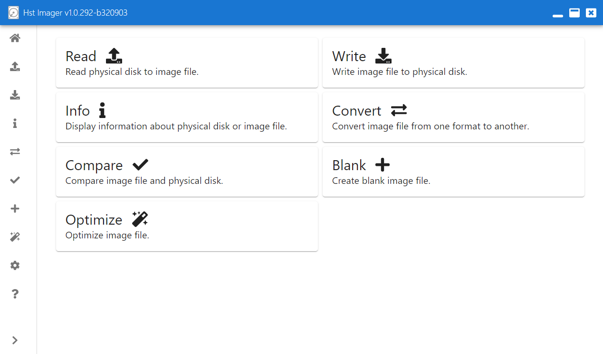

# Hst Imager Gui

## Features

Hst Imager gui comes with following features:
- List physical drives.
- Read information from physical drive or image file.
- Read physical drive to image file.
- Write image file to physical drive.
- Convert image file between .img/.hdf and .vhd.
- Create blank .img/.hdf and .vhd image file.
- Optimize image file size.

## Supported operating systems

Hst Imager supports following operating systems:
- Windows
- macOS
- Linux

## Installation

### Windows 64-bit

Install Hst Imager for Windows 64-bit with following steps:

1. Download Hst Imager Windows x64 setup .exe from [releases](https://github.com/henrikstengaard/hst-imager/releases).
2. Double-click downloaded Hst Imager macOS setup .exe in Windows Explorer.
3. First time Hst Imager started, SmartProtect will prevent it from starting as it's downloaded from web and not signed.
4. Click "More info".
5. Click "Run anyway".

Hst Imager for Windows 64-bit is now starting and ready to use.

A portable version is also available for Windows, which can be started without installing Hst Imager.

### macOS 64-bit

Install Hst Imager for macOS 64-bit with following steps:

1. Download Hst Imager macOS x64 .dmg from [releases](https://github.com/henrikstengaard/hst-imager/releases).
2. Double-click downloaded Hst Imager macOS .dmg in Finder, Downloads.
3. Drag Hst Imager to Applications.
4. Double-click Hst Imager in Applications to start Hst Imager.
5. First time Hst Imager is started a warning will popup saying it's be opened because the developer cannot be verified.
6. Click "Cancel".
7. Open System Preferences, Security & Privacy, General and click "Open Anyway".
8. A warning will popup if you are sure you want to open Hst Imager.
9. Click "Open" to start Hst Imager.

Hst Imager for macOS 64-bit is now starting and ready to use.

### Linux 64-bit - Ubuntu with desktop

Install Hst Imager for Linux 64-bit with following steps:

1. Download Hst Imager Linux x64 .deb from [releases](https://github.com/henrikstengaard/hst-imager/releases).
2. Open Terminal.
3. Type `sudo dpkg -i .deb` and press enter to install Hst Imager debian package. Note path to .deb might be different depending on release downloaded and where it's extracted.
4. Open Hst Imager in show applications.

Hst Imager for 64-bit Linux is now starting and ready to use.